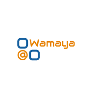

<a name="readme-top"></a>

<!--
HOW TO USE:
This is an example of how you may give instructions on setting up your project locally.

Modify this file to match your project and remove sections that don't apply.

REQUIRED SECTIONS:
- Table of Contents
- About the Project
  - Built With
  - Live Demo
- Getting Started
- Authors
- Future Features
- Contributing
- Show your support
- Acknowledgements
- License

OPTIONAL SECTIONS:
- FAQ

After you're finished please remove all the comments and instructions!
-->

<div align="center">
  <!-- You are encouraged to replace this logo with your own! Otherwise you can also remove it. -->
  
  <br/>

  <h3><b>My Portfolio Website</b></h3>

</div>

<!-- TABLE OF CONTENTS -->

# 📗 Table of Contents

- [📖 About the Project](#about-project)
  - [🛠 Built With](#built-with)
    - [Tech Stack](#tech-stack)
    - [Key Features](#key-features)
  - [🚀 Live Demo](#live-demo)
- [💻 Getting Started](#getting-started)
  - [Setup](#setup)
  - [Prerequisites](#prerequisites)
  - [Install](#install)
  - [Usage](#usage)
  - [Run tests](#run-tests)
  - [Deployment](#triangular_flag_on_post-deployment)
- [👥 Authors](#authors)
- [🔭 Future Features](#future-features)
- [🤝 Contributing](#contributing)
- [⭐️ Show your support](#support)
- [🙏 Acknowledgements](#acknowledgements)
- [📝 License](#license)

<!-- PROJECT DESCRIPTION -->

# 📖 My Portfolio Website <a name="about-project"></a>


My Portfolio Website is a project that describes me as a programmer, my skills, projects built and social media contacts. I created the project using HTML and CSS.

## 🛠 Built With <a name="built-with"></a>
1- HTML.

2- CSS.

### Tech Stack <a name="tech-stack"></a>

<details>
  <summary>Client</summary>
  <ul>
    <li><a href="https://html.com/">HTML</a></li>
    <li><a href="https://www.w3schools.com/css/">CSS</a></li>
  </ul>
</details>


<!-- Features -->

### Key Features <a name="key-features"></a>

- Added HTML file.
- Added style.css file.
- Added header.
- Added headline section.
- Added responsivenes css.

<p align="right">(<a href="#readme-top">back to top</a>)</p>

<!-- LIVE DEMO -->

## 🚀 Live Demo <a name="live-demo"></a>

> Coming soon...

<p align="right">(<a href="#readme-top">back to top</a>)</p>

<!-- GETTING STARTED -->

## 💻 Getting Started <a name="getting-started"></a>

To get a local copy up and running, follow these steps.

### Prerequisites

In order to run this project you need:

1- Web browser

2- Code editor

3- Git-smc


### Setup

Clone this repository to your desired folder:

Run this command:

```sh
git clone git@github.com:sylvester-wamaya/portfolio-website.git
```


### Install

Install this project with:

Run this command:

```sh
  cd my-project
  npm install
```


### Usage

To run the project, execute the following command:
```sh
Open index.html
```
or 
```sh
explorer.exe index.html
```

### Run tests

> Coming soon


### Deployment

> Coming soon

<p align="right">(<a href="#readme-top">back to top</a>)</p>

<!-- AUTHORS -->

## 👥 Authors <a name="authors"></a>

👤 Sylvester Wamaya

- GitHub: [@githubhandle](https://github.com/sylvester-wamaya)
- Twitter: [@twitterhandle](https://twitter.com/The_Seal_)
- LinkedIn: [LinkedIn](https://www.linkedin.com/in/sylvester-wamaya-b11a93112/)


<p align="right">(<a href="#readme-top">back to top</a>)</p>

<!-- FUTURE FEATURES -->

## 🔭 Future Features <a name="future-features"></a>

- [ ] Add Projects section.
- [ ] Add Footer
- [ ] Add more styling

<p align="right">(<a href="#readme-top">back to top</a>)</p>

<!-- CONTRIBUTING -->

## 🤝 Contributing <a name="contributing"></a>

Contributions, issues, and feature requests are welcome!

Feel free to check the [issues page](../../issues/).

<p align="right">(<a href="#readme-top">back to top</a>)</p>

<!-- SUPPORT -->

## ⭐️ Show your support <a name="support"></a>


If you like this project give it a ⭐.

<p align="right">(<a href="#readme-top">back to top</a>)</p>

<!-- ACKNOWLEDGEMENTS -->

## 🙏 Acknowledgments <a name="acknowledgements"></a>


I would like to thank Microverse for their continued support and inspiration.

<p align="right">(<a href="#readme-top">back to top</a>)</p>


<!-- LICENSE -->

## 📝 License <a name="license"></a>

This project is [MIT](./LICENSE) licensed.

<p align="right">(<a href="#readme-top">back to top</a>)</p>